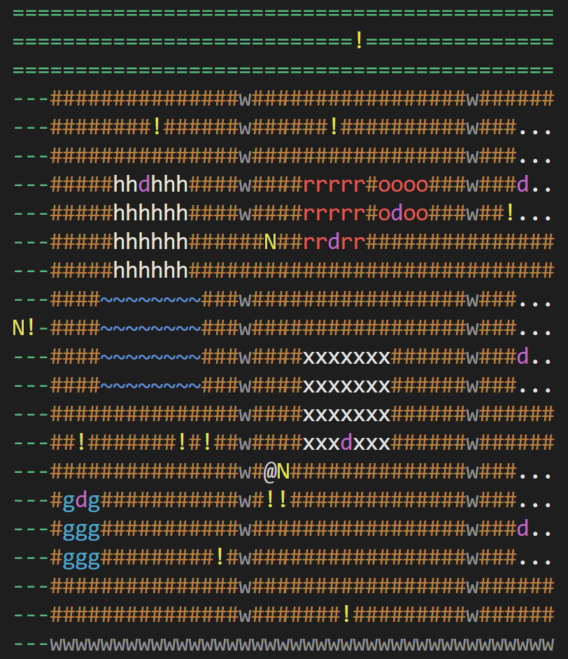
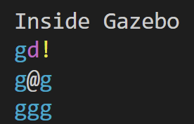

# ZOOrk (Assessment 3A CSE3PSD)



<br>

**Name:** Ella Raputri

**Class:** LT6O

**Student ID (Binus):** 2702298154

**Student No. (La Trobe):** 23025379

<br>

## Project Description
ZOOrk is a C++20 text adventure game inspired by the command line game application (Zork). In this game, user can explore, interact, and walk through the story of Pint, the main character of this story. 

<br>

## Requirements 
- CMake 3.23 or higher.
- C++20 compatible compiler, such as GCC, Clang, or MSVC. 
- Dependency to the single header version of nlohmann/json, which is automatically downloaded through CMake FetchContent. 

<br>

## Building the Application

### Clone the Repository

```bash
git clone https://github.com/Ella-Raputri/Zork-Assessment3
cd ZOOrk
```

### Configure and Build

```bash
cmake -B build
cmake --build build
```

### Run the Application

#### Linux/macOS

```bash
./build/ZOOrk
```

#### Windows Powershell

```powershell
.\build\Debug\ZOOrk.exe
```

### Run the Application (Without Building It)
To make our life easier, I have also included a compiled ZOOrk.exe in the root of this repository. 

#### Linux/macOS

```bash
./ZOOrk
```

#### Windows Powershell

```powershell
.\ZOOrk.exe
```

> Note:
> The game requires the `data` folder at runtime. If you share the application, make sure to include the `data` directory, or else maps and other game resources may fail to load. 

<br>

## Game Features
- A 2D ASCII map with multiple indoor rooms and restricted access mechanics (door or restricted cell). 
- Multiple item types (usable items, equippable items, and clue items).
- Interactive NPC system.
- A mystery game story with multiple checkpoints. 

> Note: The game does not save player's data, so the player has to replay the game if they want to play the game after quitting.

<br>

## Game Commands
### Movement:
- `Go north` or `go n`: move the player to the north.
- `Go south` or `go s`: move the player to the south.
- `Go east` or `go e`: move the player to the east.
- `Go west` or `go w`: move the player to the west.
- `Teleport <x> <y>`: teleport the player to (x,y).

### Interaction:
- `look` or `see`: print the description of the surroundings.
- `look <thing>` or `see <thing>`: print the description of the item or NPC that you look.
- `map`: print the room map.
- `talk <npc>` or `inspect <npc>`: talk to a nearby NPC or inspect a nearby non-takeable object.

### Item commands:
- `take <item>`  or `get <item>`: pick up an item from the cell.
- `drop <item>`: drop an item from the player’s inventory to the cell.
- `use <item>`: use an item. The item needs to be a UsableItem.
- `equip <item>`: equip an item. The item needs to be an EquippableItem. Note: the player can only equip an item at one time.
- `unequip`: unequip current item.
- `inventory`: show player’s current inventory.

### Others:
- `help`: to print the command list that can be used.
- `quit` or `q`: to quit the game. 

<br>

## Important Notes for Playing
Default outdoor map: 


<br> 

Sample indoor room map: 



<br> 

- There are several rooms in the default outdoor map. Some indoor rooms can be entered only through a door (the `d` cell).
- After entering an indoor room, the display can be different from the default outdoor map. 
- `N` represents NPC or non-takeable but talkable and inspectable object, `!` represents items, and `@` represents the player. 
- To trigger a story checkpoint, you need to have some items inside your inventory and interact with a specific NPC. 

    > Note: Gather all items and talk to all NPCs to ensure that you did not miss anything if you want to progress through the story. 

<br>

## Folders
- `command` folder, contains the Command class and its subclasses. The Command class is the commands that are executed when we enter a room or passage. 
- `core` folder, contains the main engine (ZOOrkEngine) to manage the game flow and the checkpoint manager to manage the story checkpoint progress of the player. 
- `data` folder, contains the additional data that will be loaded in the game, such as story checkpoints, items, map, and NPCs.
- `docs` folder, contains the pictures that are used in this README file.
- `entity` folder, contains the entity classes, from the base class (GameObject), Character with its subclasses (Player and NPC), and Item with its subclasses.
- `location` folder, contains location related classes, such as Cell, Passage, Room with their subclasses. 
- `map` folder, contains the loader classes that are needed to initialize the map upon starting the game, from loading the locations (map), items, to NPCs. 
- `utils` folder, contains additional helper file for the game, which is the Color namespace for cell color in the map. 
